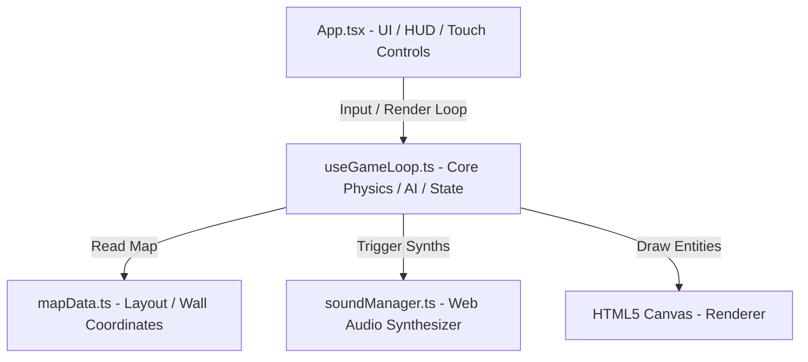

# System Patterns: Hide Quickly 2D

## アーキテクチャ構成
本アプリケーションは Vite + React + TypeScript + TailwindCSS をベースにしています。
ゲームシステムは、Reactの宣言的UIとHTML5 Canvasによる高頻度レンダリングを組み合わせたハイブリッド設計を採用しています。

## 主要モジュールと設計パターン

### 1. ゲームループと物理演算 (`useGameLoop.ts`)
- `requestAnimationFrame` による高精度な毎フレームアップデート。
- **衝突解決**: AABB（軸平行境界ボックス）矩形と円形（プレイヤー）の交点距離を用いた、滑らかなスライド衝突解決アルゴリズム。
- **動的視野（FOV）**: レイキャスト遮蔽判定（Line-vs-AABB）を用いて、障害物の裏に隠れているキャラクターがシーカーの光を透過しないようにシミュレート。

### 2. ホラー音響 (`soundManager.ts`)
- 音声ファイルのロードによる遅延やデコード失敗を防ぐため、Web Audio APIを用いてすべての効果音と環境音（足音、クリック、心音、風ドローンなど）をオシレータとゲインノードでリアルタイムに波形合成するパターン。

### 3. レスポンシブ＆タッチ入力統合 (`App.tsx`)
- マウス移動、キーボード入力（W/A/S/D、Space）に加え、モバイルでのタッチイベント（`onTouchStart`/`Move`/`End`）をフックし、仮想アナログスティックおよび画面タップアクションにマッピング。
